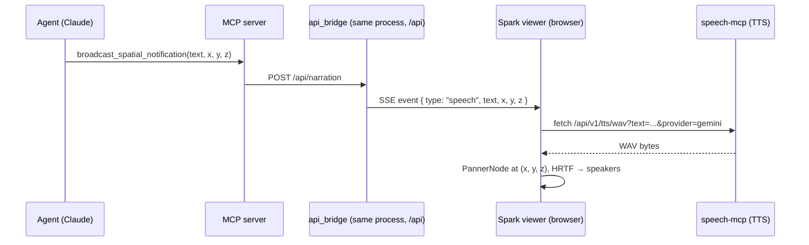

# Architecture

worldlabs-mcp is three cooperating pieces plus two optional external servers.

```
┌────────────────────┐       stdio        ┌─────────────────────────────┐
│  Claude Desktop /  │ ◄───────────────── │   MCP server                │
│  Cursor / ...      │                    │   worldlabs_mcp.server      │
└────────────────────┘                    │   - 16 @mcp.tool() tools    │
                                          │   - Marble REST client      │
                                          └────┬────────────────────────┘
                                               │ mounts
                                               ▼
                                          ┌─────────────────────────────┐
                                          │   api_bridge.py router      │
                                          │   at /api/* on port 10865   │
                                          │   (uvicorn run by           │
                                          │   web_sota/start.ps1)       │
                                          └────┬───────┬───────┬────────┘
                                               │       │       │
                   ┌───────────── SSE ────────┘        │       │
                   │                                    │       │
          ┌────────▼────────┐                  ┌────────▼────┐  └─────────┐
          │  web_sota       │                  │  speech-mcp │            │
          │  Vite frontend  │                  │  (optional, │  ┌─────────▼──────┐
          │  port 10864     │                  │  port 10918)│  │ blender-mcp    │
          │                 │                  └─────────────┘  │ unity3d-mcp    │
          │  - SparkViewer  │                                   │ resonite (OSC) │
          │  - dashboard    │                                   └────────────────┘
          └─────────────────┘
```

## Ports

| Port  | Owner                      | Role                                                    |
|-------|----------------------------|---------------------------------------------------------|
| 10864 | Vite dev server            | webapp frontend                                         |
| 10865 | `worldlabs_mcp.server:app` | `/api/*` — Marble proxy + narration SSE + webapp state  |
| 11434 | Ollama                     | local LLM for prompt refinement (optional)              |
|  1234 | LM Studio                  | local LLM for prompt refinement (optional)              |
| 10918 | speech-mcp                 | Gemini Flash TTS backend for the voice agent (optional) |
| 10700 | blender-mcp                | DCC handoff (optional)                                  |
| 10730 | unity3d-mcp                | DCC handoff (optional)                                  |
|  9000 | Resonite                   | OSC receiver for handoff (optional)                     |

Per the fleet index, 10864 and 10865 are the two ports reserved for this project.

## Why there's only one bridge

Earlier versions (0.2.x–0.3.x) had two FastAPI bridges: one mounted into the MCP
server's ASGI app, another standalone in `web_sota/backend/bridge.py`. They ended
up with partially overlapping routes and conflicting port stories. As of v0.4.0:

- `src/worldlabs_mcp/api_bridge.py` is the single source of truth.
- `web_sota/backend/bridge.py` is a thin re-export that lets you run the bridge
  standalone (without the MCP stdio server) via
  `uv run uvicorn web_sota.backend.bridge:app --port 10865`.
- `web_sota/start.ps1` runs `uvicorn worldlabs_mcp.server:app --port 10865`,
  which mounts the same router at `/api/*`.

Either entry point serves the same API surface.

## The MCP server (`src/worldlabs_mcp/server.py`)

Defines 16 MCP tools:

- **generate**: `generate_world_from_text`, `_image`, `_multi_image`, `_video`,
  `_media_asset`
- **upload**: `upload_and_generate`, `prepare_media_upload`
- **poll**: `get_operation`, `wait_for_world`
- **world**: `list_worlds`, `get_world`
- **spatial** (speculative): `broadcast_spatial_notification`,
  `broadcast_spatial_audio`, `place_world_tv`, `spawn_agent_avatar`
- **meta**: `worldlabs_help`

All generate tools default to `marble-1.1` (1500 credits/world). Pass
`model="marble-1.1-plus"` for auto-expanding worlds (1500 + 300/dynamic cube).

## The bridge (`src/worldlabs_mcp/api_bridge.py`)

- `/api/generate/{text,image,video}` — Marble proxy that returns an operation
- `/api/operations/{id}` and `/api/operations/{id}/stream` — poll + SSE status
- `/api/worlds/{id}` and `/api/worlds/{id}/download` — world details + stream proxy
- `/api/local-assets/{path}` — serves `.spz`/`.rad`/`.ply`/`.ksplat`/`.splat`
  from `WORLDLABS_LOCAL_PATH` or `~/Downloads`
- `/api/narration` (POST) and `/api/narration/stream` (SSE) — the Spatial
  Voice Agent channel. `broadcast_spatial_notification` etc. POST here;
  `spark-viewer.tsx` subscribes to the SSE stream and plays the audio
  through a WebAudio `PannerNode` at the given coordinates.
- `/api/history` — last 50 local operations, persisted to
  `%APPDATA%/worldlabs-mcp/history.json` (Windows) or
  `~/.worldlabs-mcp/history.json` (POSIX)
- `/api/prompts` CRUD — favourites/stars/comments on prompts
- `/api/llm/discover` + `/api/llm/refine` — probes Ollama and LM Studio;
  refines a short prompt into a 20-line Marble-optimised technical spec
- `/api/export/{blender,unity3d,resonite}` and `/api/handoff` — DCC handoff
- `/api/capabilities` — runtime feature gating for the frontend

## Data flow: Spatial Voice Agent



Note: the `S→B` hop is in-process — the MCP server and the bridge share the
same FastAPI app. The tool still POSTs via `httpx` for simplicity, but the
round trip stays on localhost.
